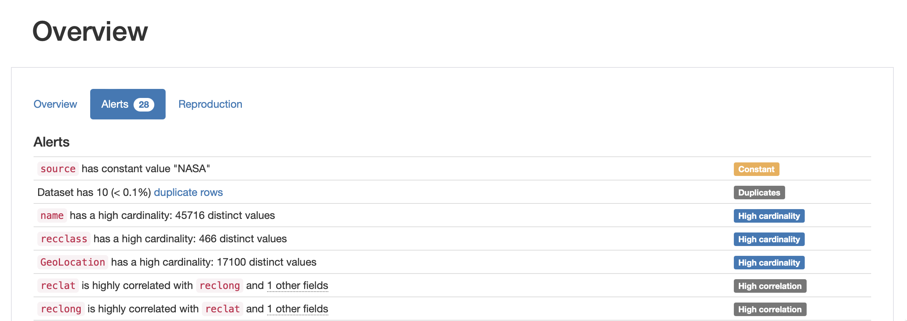
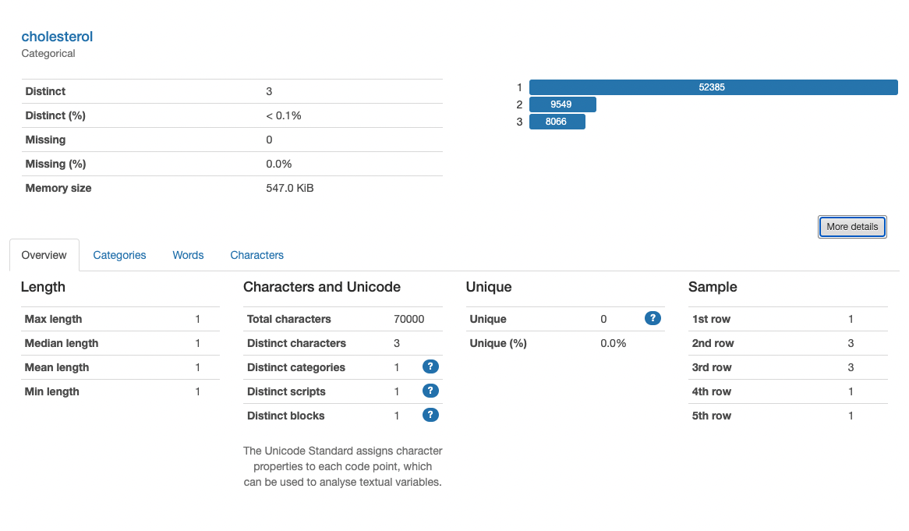
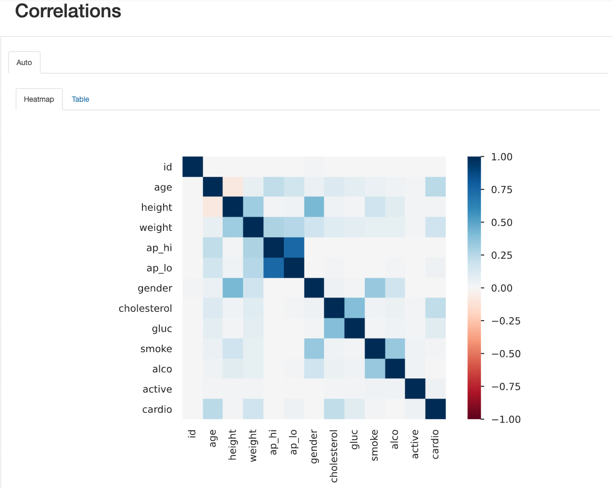
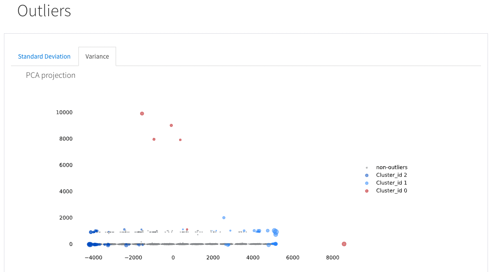

# Concepts

!!! question "Text/corpus data - your input is needed!"

    `ydata-profiling` team is considering the support of a new set of features for corpus data
    and we want to hear from you! We're particularly interested in understanding why you think
    these features would be useful, and your input will help us prioritize and refine this development.

    👉 Upvote [add here link for the request form]

## Data Structures supported

The profiling offers comprehensive insights into various types of data, including tabular, time-series text and image data. 

- **Tabular data:** when dealing with tabular data, such as spreadsheets or databases, the profiling provides valuable statistics on data distribution, central tendencies, and categorical variable frequencies.
It identifies multivariate relations such as correlations and interactions in a visual manner. It also identifies missing data.  
- **Time-series data:** when dealing with data with temporal dimensions, the profiling extends its capabilities to capture trends, seasonality, cyclic patterns and missing data gaps. 
It can reveal information about data volatility, periodicity, and anomalies, facilitating a deeper understanding of time-dependent trends.
- **Text:**  when it comes to text data, such as strings or documents, the profiling offers insightful statistics on the distribution of word frequencies, common phrases, and unique words. 

## Data types
Types, when going beyond the logical data types such as integer, floats, etc,  are a powerful abstraction for effective data analysis, allowing analysis under higher level lenses. ``ydata-profiling`` is backed by a powerful type system developed specifically for data analysis: `visions <https://github.com/dylan-profiler/visions>`_. Currently, ``ydata-profiling`` recognizes the following types:

- Boolean
- Numerical
- Date (and Datetime)
- Categorical
- Time-series
- URL
- Path
- File
- Image

Appropriate typesets can both improve the overall expressiveness and reduce the complexity of the analysis/code. 
User customized summarizations and type definitions are fully supported, with PRs supporting new data types
for specific use cases more than welcome. For reference, you can check the implementation of ``ydata-profiling``'s
default typeset [here](https://github.com/ydataai/ydata-profiling/blob/develop/src/data_analyser/model/typeset.py).

## Data quality alerts
<figure markdown>     
   {width="700"}
   <figcaption>Data quality warnings</figcaption>
</figure>

Alerts section in the *NASA Meteorites* dataset's report. Some alerts include numerical indicators. 

The **Alerts** section of the report includes a comprehensive and automatic list of potential data quality issues. Although useful, the decision on whether an alert is in fact a data quality issue always requires domain validation. Some warnings refer to a specific column, others refer to inter-column relationships and others are dataset-wide. The table below lists all possible data quality alerts and their meanings.

{{ read_csv('./data_quality_alerts.csv') }}

Information on the default values and the specific parameters/thresholds used in the computation of these alerts, 
as well as settings to disable specific ones, can be consulted in the [documentation](../advanced_settings/available_settings.md).

## Univariate profiling                                

<figure markdown>     
   {width="700"}
   <figcaption>Univariate profiling metrics and visualization</figcaption>
</figure>

This section provides a comprehensive overview of individual variables within a given dataset, this feature is particularly useful for exploratory data analysis (EDA)
as it automatically calculated detailed statistics, visualizations, and insights for each variable in the dataset. It offers information such as data type, missing values, unique values, basic descriptive statistics
, histogram plots, and distribution plots. This allows data analysts and scientists to quickly understand the characteristics of each variable, identify potential data quality issues, and gain initial insights into the data's distribution and variability. 

For more details about the different metrics and visualizations check the Univariate section details page. 

## Multivariate profiling

<figure markdown>     
   {width="700"}
   <figcaption>Multivariate profiling metrics and visualization</figcaption>
</figure>

This section provides essentials insights into the relationships between variables through correlations matrices and interactions. 
The correlation view computes and presents correlation coefficients between pairs of numerical variables, helping to identify potential linear relationships.
This assists data analysts and scientists in understanding how variables change together and highlights possible multicollinearity issues.

On the other hand, the interactions section goes beyond correlation by exploring potential nonlinear relationships and interactions between variables, providing a more comprehensive understanding of how variables interact with one another. 
This can be crucial in identifying hidden patterns that might not be captured through traditional correlation analysis.

Check the section about interactions configuration and correlation matrix metrics for more details.  

## Missing data

This section offers valuable insights into the presence and distribution of missing data within a dataset. It can be particularly helpful for data preprocessing and quality assesment as
provides a comprehensive summary of missing values across variables, indicating the percentage of missing data for each variable. Additionally, it displays a visual representation of missing data patterns through bar plots and heatmaps, 
allowing users to quickly identify which variables have the most significant amount of missing information.

Check how you can configure your missing data visualization. 
                
## Outliers **

<figure markdown>     
   {width="700"}
   <figcaption>Outliers identification</figcaption>
</figure>

This section provides a comprehensive profiling over the potential dataset outliers. You can validate and observe outliers presence and deviation from the general distribution of numerical variables
based on observed variance. 
The identification of outliers allows the data analyst or scientist to assess whether they are genuine data anomalies or erroneous entries, allowing for informed decisions on whether to retain, transform, or exclude these points in further analyses.

Feature limited to user of the [cloud hosted solution](http://ydata.ai/register?utm_source=ydata-profiling&utm_medium=documentation&utm_campaign=YData%20Fabric%20Community).

## Preview data 
For a quick overview of the data, ydata-profiling provides the following sections that can be easily configure by the user:
- First n records of a given dataset
- Last n records of a given dataset
- A table containing observed duplicates (exact matches)

